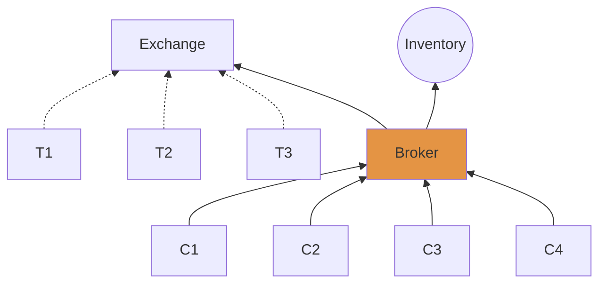
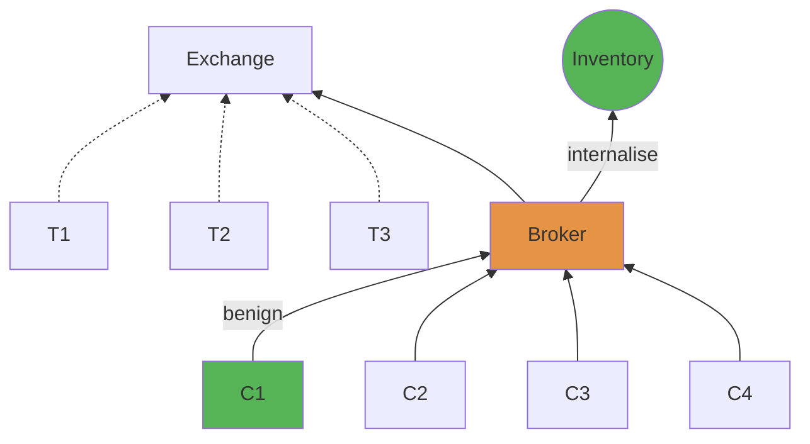
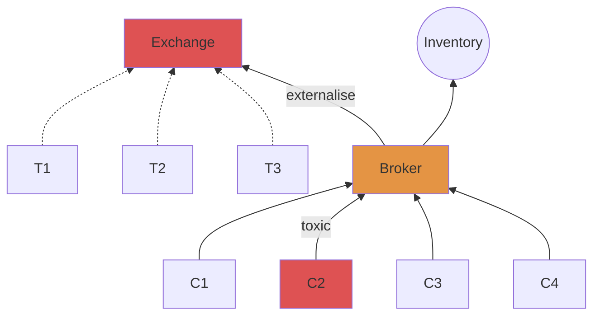

# Detecting toxic flow
An online Bayesian approach

Álvaro Cartea, **Gerardo Duran-Martin**, and Leandro Sánchez-Betancourt

---

# Forex (FX) trading from a broker’s POV

- Broker uses exchange to hedge position
- Broker uses inventory to provide liquidity



---

# Deciding whether to hedge or keep the trade

- A trade arrives from client $C$ at time $t \in (0, T)$.
- Given a fixed *toxicity horizon* $0 < \mathfrak G \ll T$, the broker decides whether she wants to **externalise or internalise** the trade for the period $[t, t + \mathfrak G]$.
- We consider $\mathfrak G$ to be, e.g., `1s`, `15s`, `1min`

---

## Internalise: benign flow between $[t, t + \mathfrak{G}]$

Client cannot profit from broker at any point between $[t, t + \mathfrak{G}]$



---

## Externalise: toxic flow between $[t, t + \mathfrak{G}]$

Client can profit from broker at any point between $[t, t + \mathfrak{G}]$



---

# Toxic flow at a toxicity horizon $\mathfrak{G}$

How clients make money out of the broker

---

## Toxic buy trade for $\mathfrak{G} = 10$ (EUR/USD)

- Trader: **buys** at orange line, sell in blue region
- Broker: **sells** in orange line, buys in blue region


---

# The effect of the toxicity horizon $\mathfrak G$
Toxicity horizon: top 6 clients by number of trades.
Source: LMAX Broker data


---
layout: center
---

## Broker’s goal

Given a toxicity horizon $\mathfrak G$, the goal of the broker is to externalise as much toxic flow as possible and internalise as much benign flow as possible ⇒ **classification problem**.

---

## Research questions

1. How much PnL and avoided loss we obtain by classifying trades as toxic or benign?
2. How do we construct a classifier?
3. What features are useful to make a prediction?

---

# Predicting toxicity
Toxic flow detection as a classification problem

### Notation

- target variable $y_t \in \{0,1\}$ — whether the period $[t, t+\mathfrak G]$ is toxic (available after time $t + \mathfrak G$).
- features ${\bf x}_t \in \mathbb{R}^M$ — available at time $t$.
- $\text{Bern}(y | m) = m^{y} ( 1 - m)^{1-y}$ — PMF for a Bernoulli-distributed random variable $y$
- $\boldsymbol\theta\in\mathbb{R}^D$ the model parameters
- $f: \mathbb{R}^D \times \mathbb{R}^M \to [0,1]$ is a statistical model
- $\hat y_t = f(\boldsymbol\theta, {\bf x}_t)$ a prediction at time $t$.

---

# The models

1. Bernoulli via maximum-likelihood
2. Logistic regression
3. Random forest
4. **Neural network**

---

## Moon’s dataset: a toy dataset**

**denotes the toy dataset.


---

## The train / test approach to training machine learning algorithms for time series data


---

### Implicit assumptions

1. Data is independent and identically distributed (iid) for both  ${\cal D}_\text{train}$ and ${\cal D}_\text{test}$
2. The data in ${\cal D}_\text{train}$ captures enough information to make accurate predictions in ${\cal D}_\text{test}$

**Neither assumption is usually true in practice**, so that a train / test / retrain approach is often used.

---

## An online approach to training statistical models

A *limit case* to the train / test / retrain approach: at time $t$, we’re only interested in the error at time $t+1$.


---

## A Bayesian online approach to training statistical models

Let $f: \mathbb{R}^D\times \mathbb{R}^M \to [0, 1]$ be a statistical model parametersied by $\boldsymbol\theta\in\mathbb{R}^D$. Suppose $p(\boldsymbol\theta \vert {\cal D}_{1:t-1})$ —the prior— is known. We seek to obtain sequential estimates of $\boldsymbol\theta$ as

$$
\begin{aligned}
p(\boldsymbol\theta | {\cal D}_{1:t}) &\propto p(y_t \vert \boldsymbol\theta, {\bf x}_t)p(\boldsymbol\theta \vert {\cal D}_{1:t-1}),\\
p(y_t\vert{\boldsymbol\theta}, x) &= \text{Bern}(y_t \vert f(\boldsymbol\theta, x))
\end{aligned}
$$

---

### Hurdles of sequential Bayesian updating

- Estimating $p(\boldsymbol\theta | {\cal D}_{1:t})$ in closed form requires the prior $p(y_t \vert \boldsymbol\theta, {\bf x})$ and the likelihood $p(\boldsymbol\theta \vert {\cal D}_{t-1})$ to be **conjugate**.
- Our statistical model is a Bernoulli-distribution, which is **not** conjugate to a Gaussian.
- For statistical machine learning models, we assume that the parameters of the model are Normally-distributed (The Gaussian ansatz)
- Multiple ways to get an *********approximate********* posterior distribution.

---

## The Recursive Variational Gaussian Approximation (R-VGA)

See [The recursive variational Gaussian approximation (R-VGA)](https://www.notion.so/The-recursive-variational-Gaussian-approximation-R-VGA-f7f5772b9ef04addaeb0b4d40d9417ef?pvs=21) — moment-propagation as online learning.

Define $q_0(\boldsymbol\theta) = {\cal N}(\boldsymbol\theta | {\bf m}_0, {\bf S}_0)$. Then, for $t=1,\ldots, T$:

$$
\begin{aligned}
{\bf m}_t, {\bf S}_t &=
\argmin_{ {\bf m}, {\bf S}_t}
\text{KL}({\cal N}(\boldsymbol\theta | {\bf m}, {\bf S}) || p(y_t \vert \boldsymbol\theta) q_{t-1}(\boldsymbol\theta))\\
q_t(\boldsymbol\theta) &= {\cal N}(\boldsymbol\theta | {\bf m}_t, {\bf S}_t)
\end{aligned}
$$

yields the fixed-point equations

$$
\begin{aligned}
{\bf m}_t &= {\bf m}_{t-1} + {\bf S}_{t-1}\mathbb{E}_{q_t}\left[ \nabla_{\boldsymbol\theta}\log p(y_t \vert \boldsymbol\theta) \right]\\
{\bf S}_t^{-1} &= {\bf S}^{-1}_{t-1} - \mathbb{E}_{q_t}\left[\nabla_{\boldsymbol\theta}^2\log p(y_t \vert \boldsymbol\theta)\right]
\end{aligned}
$$

---

## RVGA update


---

## Online learning of neural networks using R-VGA

Our choice of neural network: a multilayered-perceptron (MLP)


---

## R-VGA for neural networks**

Three-hidden layer MLP, 50 units per layer, and ReLu activation function.


---

## RVGA drawbacks

- For a model with $D$ parameters, an RVGA-like update incurs in in a memory cost of $O(D^2)$ — one step the three-hidden layer MLP that we will consider later on would incur in **190gb of memory per-datapoint**.
- RVGA is statistically efficient, but not memory (or time) efficient

---

# Our work: a procedure for asynchronous and efficient neural-network training

1. Memory and time efficient way to do online learning of neural networks.
2. Asynchronous model predictions: A prediction made at time $t$ is not available until time $t + \mathfrak G.$

**We call our method PULSE.**

---

# The projection-based unification of last-layer and subspace estimation (PULSE)

Main components:

1. subspace neural networks,
2. hidden-layers / output-layer decomposition, and
3. RVGA-like update rule.

---

## 1. Intrinsic dimension hypothesis

See [Measuring the Intrinsic Dimension of Objective Landscapes \[1804.08838\]](https://www.notion.so/Measuring-the-Intrinsic-Dimension-of-Objective-Landscapes-1804-08838-18efd94d0c804054b176426c9aefebbc?pvs=21) and [Intrinsic dimension hypothesis](https://www.notion.so/Intrinsic-dimension-hypothesis-8370afbedfa345bca87de6e337c7d72e?pvs=21).

Training within a **random, low-dimensional affine subspace** *can* suffice to reach high training and test accuracies on a variety of tasks, provided the training dimension exceeds a threshold that called the **intrinsic dimension**.

$$
\boldsymbol\theta = {\bf Az} + {\bf b}
$$

With ${\bf A}\in\mathbb{R}^{D\times d}$ and ${\bf b}\in\mathbb{R}^D$ fixed, and ${\bf z} \in \reals^{d}$, with $d \ll D$, the degrees of freedom.

---

## Learning in a subspace: R-VGA v.s. subspace R-VGA**

See [One-pass learning methods for training Bayesian neural networks](https://www.notion.so/One-pass-learning-methods-for-training-Bayesian-neural-networks-a9133bf9e9574c49b8243d163414d447?pvs=21). The setup.

- Multilayered perceptron (MLP) with three layers, 50 units per layer, and ReLU activation — `5301` units. Train using 500 samples / Test using 300 samples.
- Less than 2% of the total degrees of freedom are required to achieve comparable performance.


---

## Learning the projection matrix $\bf A$ and the offset $b$

See [How many degrees of freedom do we need to train deep networks: a loss landscape perspective \[2107.05802\]](https://www.notion.so/How-many-degrees-of-freedom-do-we-need-to-train-deep-networks-a-loss-landscape-perspective-2107-05-fd7472302b2844e2a67fa92544c78847?pvs=21) — authors show that this method increases the probability of achieving high training and test sets.

```python
d = 100
w = [...] # Size D
params = [w]
for n in n_warmup:
	w = update_step(w, warmup) # one epoch using adam
  params = [params, w]
A = svd(params)[:, :d]
b = w[:]
```

---

## 2. Decomposing the architecture into hidden layers / output layer

See [Do Bayesian Neural Networks Need To Be Fully Stochastic? \[2211.06291\]](https://www.notion.so/Do-Bayesian-Neural-Networks-Need-To-Be-Fully-Stochastic-2211-06291-4d25a2b6015f4f088d9aa8e655862b64?pvs=21).
We split the neural network into hidden-layer parameters ($\boldsymbol\psi$) and output-layer parameters ($\bf w$).


---

### Subspace-hidden-layers + last layer

Suppose

$$
p(y_t = 1 | \boldsymbol\theta, {\bf x}_t) = \text{Bern}(1 | \sigma({\bf w}^\intercal g({\bf A z} + {\bf b};{\bf x}_t)))
$$

With fixed ${\bf A}$ and ${\bf b}$, ${\bf w}$ the output-layer parameters,  ${\bf z}$ the subspace hidden-layer parameters,  and $\sigma(z) = (1 + \exp(-z))^{-1}$ is the sigmoid function.

---

## 3. RVGA-like update

Learn projected feature transformation parameters and full-dimension of last-layer parameters

At every update $t$, we seek to obtain $\boldsymbol\mu_t$, $\boldsymbol\nu_t$, $\boldsymbol\Sigma_t$, and $\boldsymbol\Gamma_t$ for

$$
\begin{aligned}
\phi_t({\bf w}) &= {\cal N}({\bf w}| {\boldsymbol\nu}_t, \boldsymbol\Sigma_t)\\
\varphi_t({\bf z}) &= {\cal N}({\bf z} | \boldsymbol\mu_t, \boldsymbol\Gamma_t)
\end{aligned}
$$

By recursively solving the optimisation problem

$$
\argmin_{\boldsymbol\mu,\boldsymbol\nu,\boldsymbol\Gamma,\boldsymbol\Sigma} \text{KL}\Big(\phi_t({\bf w})\varphi_t({\bf z}) || \phi_{t-1}({\bf z}) \varphi_{t-1}({\bf w})q(y_t \vert {\bf z}, {\bf w}; {\bf x}_t)\Big)
$$

with $q_t(y_t \vert {\bf z}, {\bf w}; {\bf x}_t) = {\cal N}(y_t \vert \hat\sigma_t, \hat\sigma_t(1-\hat\sigma_t))$, and $\hat\sigma_t$ the first-order approximation of the model around the previous posterior means $\boldsymbol\mu_{t-1}$ and $\boldsymbol\nu_{t-1}$.

---

# The PULSE equations

The problem above yields the following equations 

$$
\begin{aligned}
{\boldsymbol\nu}_t
&= \boldsymbol\nu_{t-1} + \boldsymbol\Sigma_{t-1} h(\boldsymbol\mu_{t-1}; {\bf x}_t)(y_t - \sigma(\boldsymbol\nu^\intercal_{t-1} h(\boldsymbol\mu_{t-1}; {\bf x}_t)))\\
\boldsymbol\Sigma^{-1}
&= \boldsymbol\Sigma^{-1}_{t-1} + \sigma'(\boldsymbol\nu^\intercal_{t-1} h(\boldsymbol\mu_{t-1}; {\bf x}_t))h(\boldsymbol\mu_{t-1};{\bf x}_t)^\intercal h(\boldsymbol\mu_{t-1};{\bf x}_t)\\
\boldsymbol\mu_t &= \boldsymbol\mu_{t-1} + 
\boldsymbol\Gamma_{t-1}\nabla_{\bf z}h(\boldsymbol\mu_{t-1}; {\bf x}_t)(y_t - \sigma(\boldsymbol\nu^\intercal_{t-1} h(\boldsymbol\mu_{t-1}; {\bf x}_t)))\\
\boldsymbol\Gamma_t^{-1} &=
\boldsymbol\Gamma^{-1}_{t-1} + 
\sigma'(\boldsymbol\nu^\intercal_{t-1} h(\boldsymbol\mu_{t-1}; {\bf x}_t))\nabla_{\bf z} h(\boldsymbol\mu_{t-1}; {\bf x}_t)\nabla_{\bf z} h(\boldsymbol\mu_{t-1}; {\bf x}_t)^\intercal
\end{aligned}
$$

with $h({\bf z}; {\bf x}) = g({\bf Az} + {\bf b}, {\bf x}_t)$

---

## The PULSE approach to training statistical model

Suppose $s + \mathfrak G < t$.

Client trades at time $s$, observe result and update weights at time $t + \mathfrak G$, make inference at time $t$ using the weights found at time $t + \mathfrak G$.


---

## Asynchronous predictions in PULSE

Parameter update and prediction


---
layout: center
---

# Back to the broker’s problem

---

# The Data

- **All plots and results we show are taken from LMAX broker between 28 June 2022 and 21 October 2022**
- EUR/USD top of book
- Market orders only
- We consider top 6 clients with most number of orders

---

# The features ${\bf x}_t$

Two classes of features

1. LOB features
2. Client features

**183 features in total**

---

## LOB / clocks features

- We construct features for each of the ******two****** sides of the book: bid / ask
- For each side of the book we consider **three** clocks: a ****time**** clock, a ***********transaction*********** clock, and a *******volume******* clock
- Each clock considers **seven** intervals spanning $[\mathfrak{C}2^{n-1}, \mathfrak{C}2^n)$ for $n=1, \ldots,7$
- Each interval summarises **four** features
    1. bid-ask spread
    2. midprice
    3. volume imbalance
    4. transformed log-volume

In total, we have `2 * 3 * 7 * 4 = 168`  features

---

## Features cont’d

1. Cash (C)
2. inventory (C)
3. volume of the order 
4. spread in the market before the order arrives
5. imbalance in the LOB before the order arrives
6. transformed available volume in the best bid
7. transformed available volume in the best ask
8. last ask price
9. last bid price
10. last midprice
11. total number of market updates
12. total number of trades made by all clients
13. total number of trades made by client $c$ (C)
14. expanding-window volatility estimate of the mid-price
15. proportion of previous sharp trades made by client $c$ (C)

---
layout: center
---

# Deployment of online methods

---

## Deployment procedure

- Hyperparameter tuning in warmup stage.
- PULSE: 38,700 parameters at warmup ⇒ update 120 degrees of freedom at deploy stage (<1/2% of total parameters)


---

# The metrics

For a given toxicity horizon $\mathfrak G$, we evaluate

- Area under the receiver operating characteristic curve (area under ROC) — quantify a classifier’s ability to distinguish between toxic and benign trades.
- Earned profit and avoided loss

---

## ROC for $\mathfrak G = 20$

receiver operating characteristic (ROC)


---

## AUC-ROC

Area under the ROC curve


---

## AUC over time

$\mathfrak G = 10s$


---

## Profitability and avoided los

We keep a trade if

$$
    \delta^{\pm *}= \mathbb{1}\left( \mathfrak{p}> p^{\pm, \text{M}}\right)\,,
$$

with

- $\mathfrak p$ the *cutoff probability*

---

## PnL and avoided loss — deploy results

Take evaluate $p^{\pm,M}$ in the deploy stage. Evaluate PnL and avoided loss for varying $\mathfrak p = \{0.05, 0.15, 0.25, \ldots, 0.95\}$.

We take all trades to be the median quantity in the dataset—€2,000


---

# Conclusions

- We presented toxic-flow detection as an online classification problem.
- We developed the PULSE method for asynchronous online training of neural networks.
- We proposed a broker’s strategy to decide which trades to internalised and which to externalise.
- We showed that PULSE attains the highest PnL and lowest avoided loss compared to each of the benchmark methods.

---
layout: end
---

Detecting toxic flow

[papers.ssrn.com/sol3/papers.cfm?abstract_id=4597879](https://papers.ssrn.com/sol3/papers.cfm?abstract_id=4597879)

[gerdm.github.io/toxic-flow-talk](https://gerdm.github.io/toxic-flow-talk)